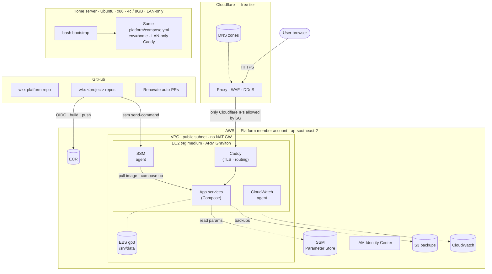

# wkx-platform

A personal Docker Compose platform for hosting side projects in two homes — AWS (public-facing) and an on-prem Ubuntu home server (LAN-only) — within an NZD $50 / month AWS budget.

> This repo is a public record of a personal infrastructure project, not a maintained product. The design and roadmap are the substance; the code lands milestone by milestone. If you want to use any of this as a starting point for your own platform, fork freely.

## What this is

- **One Graviton EC2 instance** in `ap-southeast-2` running everything in Docker Compose, with **Caddy** for TLS + reverse proxy and **Cloudflare** in front for DNS, WAF, and DDoS.
- **Multi-repo**: a platform repo (this one) holds infra + host bootstrap + platform services + a reference project; each app gets its own `wkx-<name>` repo, scaffolded via a thin in-house CLI.
- **All infra in Terraform** (AWS + Cloudflare + on-prem Docker provider). Same Compose model on AWS and on-prem.
- **Forward-compatible env dimension** baked into every namespace from day one (`prod`, `home`, `pr-<N>`), so per-branch preview environments are a feature flip away later, not a refactor.

## Architecture



## Repo layout

```
wkx-platform/
├── ROADMAP.md           — 11-milestone build sequence
├── docs/
│   ├── setup/           — public-safe template for account state
│   └── superpowers/
│       ├── specs/       — full design rationale and decisions
│       └── plans/       — milestone implementation plans
└── README.md
```

Implementation lands milestone by milestone — `infra/`, `host/`, `platform/`, `tools/`, and `template/` directories appear from M1 onward.

## Status

- **M0 — Prerequisites:** complete (AWS Organizations, IAM Identity Center, Cloudflare account, local tooling).
- **M1 — Networking + DNS skeleton:** next.

See [ROADMAP.md](ROADMAP.md) for the full sequence and per-milestone hands-on artifacts.

## Read more

- [Design](docs/superpowers/specs/2026-05-01-wkx-platform-design.md) — goals, non-goals, architecture, decisions, cost model, risks.
- [Roadmap](ROADMAP.md) — every milestone with deliverables and verification criteria.
- [M0 plan](docs/superpowers/plans/2026-05-01-m0-prerequisites.md) — bite-sized task plan for the prerequisites milestone.
