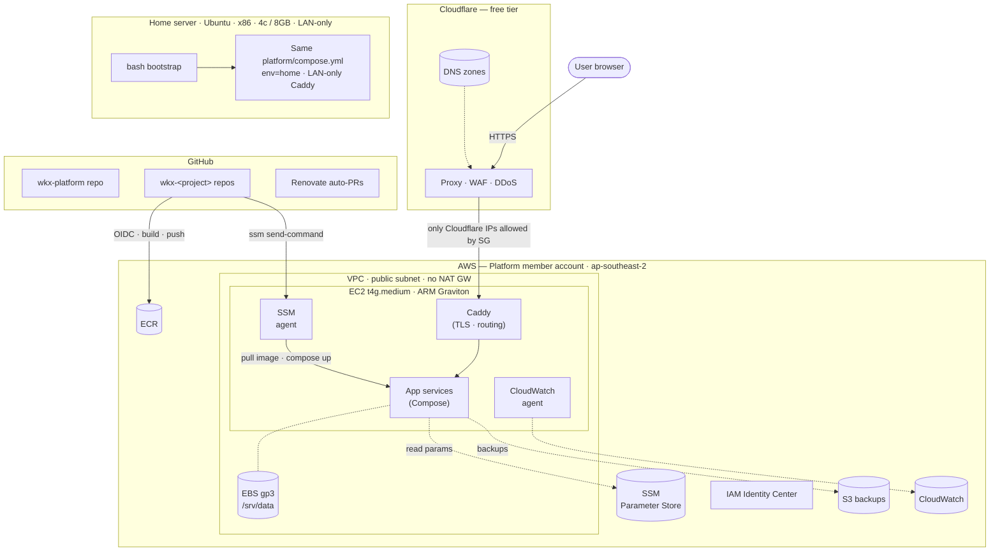

# WKX Platform — Design

Date: 2026-05-01
Status: Approved (ready for implementation planning)

## 1. Goals

- A reusable Docker Compose-based platform for hosting personal projects in two homes:
  - **Cloud (AWS):** anything public-facing. The priority.
  - **On-prem (home Ubuntu media server):** anything private-facing. LAN-only.
- One platform shape, two deploy targets. Same Compose model on both, with profile flags for the differences.
- Built component by component, with a hands-on artifact at every milestone.
- Forward-compatible for per-feature-branch preview environments without retrofit.

### Constraints

- **Budget:** less than NZD $50/mo on AWS (≈ USD $30/mo at ~1.65 NZD/USD).
- **Security first**, principle of least privilege.
- **Everything automatically upgradable** via automated PRs (Renovate + unattended-upgrades).
- **Dev environment:** macOS, devcontainers. From Compose-up, behaviour should be as similar as possible across Mac, AWS, and on-prem Linux.

## 2. Non-Goals

- High availability, multi-region, or multi-instance redundancy. Single instance is acceptable for personal scale.
- Managed databases (RDS). Containers handle DBs.
- Application Load Balancer or NAT Gateway. Both are cost-prohibitive.
- A staging environment as a separate AWS account. The env dimension (see §6) covers preview/staging-style needs without dedicated infrastructure.
- Real domain registration during initial build. The apex (`wingkongexchange.dev`) is registered in M1; `<APP_DOMAIN>` per-app domains remain placeholders.
- Workers/cron/bots are out of launch scope but the architecture (Compose + EBS + ECR) supports them when added later.

## 3. Architecture Overview



**User flow:** browser → Cloudflare proxy → EC2 (Caddy) → Compose service.
**Deploy flow:** `git push` → GitHub Actions → ECR + SSM RunCommand → EC2 pulls image → `docker compose up -d`.

## 4. Component Layers

Four layers, each with one job and a clean interface to the next. Same shape on AWS and on the home server — only the bootstrap layer differs.

| # | Layer | Owns | Tool |
|---|---|---|---|
| 4 | **Apps** | Per-project Compose service, Dockerfile, Caddy snippet, app code | `wkx-<project>` repos |
| 3 | **Platform services** | Caddy (TLS + routing), CloudWatch agent, backup runner — always-on shared services | `platform/compose.yml` |
| 2 | **Host bootstrap** | One-time idempotent host setup: Docker, Compose, agents, mounts | `host/cloud-init.yaml` (AWS), `host/bootstrap.sh` (on-prem) |
| 1 | **Infrastructure** | AWS account resources + Cloudflare zones/records | `infra/` (Terraform) |

**Interface contracts:**

- **Layer 4 → Layer 3:** App provides `compose.yml` (service definition + named volumes + `mem_limit`/`cpus`) and `caddy.snippet` (one Caddy host block). Platform aggregates them.
- **Layer 3 → Layer 2:** Platform requires Docker + Compose plugin + a writable `/srv/data`.
- **Layer 2 → Layer 1:** Bootstrap requires a Linux box with internet access and (on AWS) an instance role with the documented permissions.

## 5. Repo Model — Multi-Repo

- One **platform repo** (`wkx-platform`): infra, host bootstrap, platform Compose, deploy/scaffold tools, **reference project**.
- One repo per project (`wkx-<name>`), each scaffolded by copying the reference project from the platform repo and applying name/port/hostname substitutions.

**Platform ↔ project contract:**

1. Project repo's GHA workflow uses GitHub OIDC to assume an AWS role scoped to its own ECR repo + SSM RunCommand.
2. Workflow builds a multi-stage container (default ARM64; opt-in amd64 for projects that also run on the home server) and pushes to ECR.
3. Workflow invokes `aws ssm send-command` with a script that pulls the image, renders the env-file from SSM Parameter Store, and runs `docker compose -p <service>-<env> up -d`.
4. The host's Caddy reload picks up the snippet at `/etc/caddy/Caddyfile.d/<service>-<env>.caddy`.

Adding a project = `wkx-scaffold` script clones `wkx-platform/template/` into a new repo, runs name/port/hostname substitutions, initializes git, creates the GitHub repo, and opens a PR against `wkx-platform` adding `infra/projects/<name>.tf` (creating ECR repo, log group, DNS record).

**Why no templating library (cookiecutter/copier)?** For ≤10 personal projects with AI-assisted dev, a generic template tool is more weight than it earns. The reference project is itself a real, CI-tested working app (the M3 `hello` smoke-test app doubles as the reference). Cross-cutting changes ("add HEALTHCHECK to every Dockerfile") are handled by AI fanning out PRs to the `wkx-*` repos rather than `copier update`. The platform contract — what files a conformant project must contain and how they look — lives in `wkx-platform/CLAUDE.md`, read directly by AI agents.

### Platform repo layout

```
wkx-platform/
├── infra/                    Layer 1 — Terraform
│   ├── aws/                  account, VPC, EC2, IAM, ECR, S3, CW
│   ├── cloudflare/           zones, DNS records, page rules
│   ├── modules/              reusable: ecr-repo, log-group, dns-record
│   └── projects/             one .tf per project (ECR + log group + DNS)
├── host/                     Layer 2
│   ├── cloud-init.yaml       AWS Graviton bootstrap
│   ├── bootstrap.sh          on-prem Ubuntu bootstrap
│   └── shared/               common: install-docker.sh, dirs.sh
├── platform/                 Layer 3
│   ├── compose.yml           Caddy, cw-agent, backup runner
│   ├── Caddyfile             imports Caddyfile.d/*.caddy
│   └── env/                  prod.env, home.env
├── template/                 reference project (real working app, CI-tested)
├── tools/                    dev tooling
│   ├── scaffold/             wkx-scaffold CLI: clone template/ + substitute + push
│   ├── deploy/               SSM RunCommand wrappers (require --env)
│   └── secrets/              SSM Parameter Store helpers
├── .devcontainer/
├── .github/workflows/
├── renovate.json
└── README.md
```

### Per-project repo layout (after `wkx-scaffold`)

```
wkx-<project>/
├── src/
├── Dockerfile                multi-stage, ARM64; multi-arch opt-in
├── compose.yml               service def, mem_limit, cpus, volumes
├── caddy.snippet             one Caddy host block, env-templated
├── .github/workflows/deploy.yml
├── .devcontainer/
├── renovate.json
└── README.md
```

## 6. Environment Model

Every namespace in the platform includes an `<env>` slot from day 1, ordered **service first, then env**. The platform is service-centric: deploys, rollbacks, log queries, data restores, and audits target one service across its envs, so service-first grouping keeps a service's resources together. The env slot itself is **forward compatibility for per-branch preview environments** without paying for the feature up front.

**Defaults:**
- AWS deploys: `prod`
- On-prem deploys: `home`
- Future preview envs: `pr-<N>`, `feat-<slug>`, etc.

**Naming conventions:**

| Resource | Pattern |
|---|---|
| Hostname | prod: `<service>.wingkongexchange.dev` · non-prod: `<service>-<env>.wingkongexchange.dev` (flat — covered by single `*.wingkongexchange.dev` wildcard cert) |
| First-class hostname | `<service>-<env>.<APP_DOMAIN>` (or `www.<APP_DOMAIN>` for `prod`) |
| Compose project | `<service>-<env>` (via `docker compose -p` → isolated networks/volumes) |
| Caddy snippet | `/etc/caddy/Caddyfile.d/<service>-<env>.caddy` (flat dir; Caddy import globs allow a single wildcard, decided at M3) |
| SSM Parameter | `/wkx/<service>/<env>/<KEY>` |
| CloudWatch log group | `/wkx/<service>/<env>` |
| Data dir | `/srv/data/<service>/<env>` |
| ECR tag | `<sha>` or `<branch>-<sha>` (image is per-commit; env decides which tag deploys where) |

The public hostname hides the env for `prod` (so users see `hello.wingkongexchange.dev`, never `hello-prod.wingkongexchange.dev`); every internal namespace keeps the explicit `<service>-<env>` form. This presentation choice does not weaken the explicit-env rule — deploys still name their env.

**Implementation rules baked into M0–M10:**

1. Every per-project Terraform module **requires** an `env` input — no default. (Account-level/host-level infra is not per-env and uses no env dimension.)
2. The deploy script (`tools/deploy/`) **requires** `--env` — no default. Forgetting the flag errors out with the list of valid env patterns.
3. CI workflows hardcode their target env: PR-open jobs deploy to `pr-${{ github.event.number }}`; `main`-merge jobs deploy to `prod`. Never defaulted.
4. The reference project renders `${ENV}` placeholders at deploy time (via the scaffold script's substitution and the deploy script's env-file injection).
5. The Compose service template includes `mem_limit` and `cpus` so previews can't starve prod.
6. ECR lifecycle policy: expire `prod` tags after 30 days; expire branch tags after 14 days. For older rollbacks, rebuild from git (Renovate-pinned deps make this reliable).

**Principle:** Environments are always explicit. Defaulting to a "common" env hides intent and makes accidental prod-deploys easy. Both humans and CI workflows must name the env they target.

**Capacity ceiling:** t4g.medium with 4 GB RAM realistically runs prod + 2–4 small preview environments concurrently. If preview density becomes serious, the next step is t4g.large (USD $19/mo with 1-yr SP, total ~USD $33/mo, still under NZD $50 budget).

### AWS resource tagging strategy

Every Terraform-managed AWS resource carries a standard tag set applied via the AWS provider's `default_tags` block. The intent is queryability for cost (per-env, per-service spend), ownership (which repo owns this), and lifecycle (was this Terraform-managed or hand-rolled).

| Tag key | Value | Applied to |
|---|---|---|
| `Project` | `wkx` | always |
| `ManagedBy` | `terraform` | always |
| `Env` | `<env>` | resources with an env dimension (per-project resources, app-specific log groups, etc.); omitted for host/account-level resources |
| `Service` | `<service>` | per-service resources (a project's ECR repo, log group); omitted for shared infra |
| `Repo` | `wkx-platform` or `wkx-<project>` | the GitHub repo that owns the resource's source code |

**Activated for cost allocation:** `Project`, `Env`, `Service`. After activation in the Billing console (one-time per tag key), Cost Explorer can break spend down by these tags. Without activation, the tags exist but Cost Explorer ignores them.

**Resources that opt out of `Env` / `Service`:** the EC2 host, EBS root volume, EIP, VPC, subnets, IGW, security groups — these are platform-level, shared by all envs/services running on the box.

## 7. Cost — Steady State

Region: ap-southeast-2 (Sydney). Budget: NZD $50/mo ≈ USD $30/mo.

**Baseline plan:** t4g.medium with 1-year Compute Savings Plan, no upfront. Bring up on-demand for the first 2–4 weeks, then commit at M10.

| Line item | USD/mo |
|---|---|
| EC2 t4g.medium (1-yr SP) | $17.01 |
| EBS gp3 30 GB | $2.88 |
| Public IPv4 (Elastic IP) | $3.65 |
| CloudWatch Logs (~1 GB ingest, 7-day retain) | $0.70 |
| S3 (backups via restic, ~5 GB) | $0.13 |
| ECR (image storage) | $0.05 |
| SSM Parameter Store, Route 53, ACM, NAT GW, ALB | $0.00 |
| **Total** | **USD $24.42 ≈ NZD $40.29** |

Headroom: ~NZD $10/mo for occasional spikes (data transfer, log volume, an extra EBS volume).

## 8. Key Decisions and Tradeoffs

### 8.1 Infrastructure shape

- **Routing:** Mode 1 (own domain) + Mode 3 (subdomain on shared apex). Path-based routing rejected — every framework has its own opinions about base paths and fighting them per-project is not worth the single DNS record saving.
- **DNS provider:** Cloudflare. Free tier covers DNS + DDoS proxy + WAF + TLS proxy. Tradeoff: a second IaC tool (Cloudflare Terraform provider). Worth the friction for the security multiplier at $0.
- **IaC:** Terraform for everything (AWS + Cloudflare + Docker on-prem). Replaces the original brief's CDK-and-bash split. One tool spans all three.
- **AWS account model:** AWS Organizations with a fresh management account and a member account for the platform (option B). Keeps mgmt account workload-free per best practice. Tradeoff: three accounts to track (existing + new mgmt + platform), two new email aliases.
- **Region:** ap-southeast-2. Latency to NZ outweighs the ~10–15% cost premium over us-east-1 for interactive use.
- **Compute:** t4g.medium ARM Graviton + 1-yr Compute Savings Plan. 4 GB RAM gives DB-backed apps comfort; ARM is significantly cheaper. Tradeoff: ARM64-only image builds by default; amd64 is opt-in per project for things destined for the x86 home server.
- **Single-instance architecture:** No HA, no autoscaling. Personal traffic doesn't warrant it; ALB + 2nd instance would consume the entire budget. Tradeoff: 5–15 min downtime during instance replacement.
- **TLS:** Caddy on the box, DNS-01 wildcard cert via Cloudflare. Avoids ALB+ACM costs. Tradeoff: cert renewal lives on the box; Let's Encrypt's 30-day renewal buffer is forgiving.
- **Database:** SQLite by default (file on EBS), Postgres-as-sidecar opt-in per app. No shared platform-level Postgres — chosen deliberately to avoid blast-radius coupling and backup entanglement.
- **Repo model:** Multi-repo (option B). Platform repo + one repo per project. Each project owns its own issues/history/visibility.
- **Same Compose model on AWS + on-prem with profile flags.** One mental model. Caddy config differs in profile flags only (no Cloudflare DNS-01 on-prem; LAN-only listener).
- **On-prem access:** LAN-only. No tunnel, no VPN, no port forwards. Apps unreachable when away from LAN — accepted.
- **Forward compatibility for preview envs:** Every namespace includes an `<env>` slot from day 1; default `prod` for cloud, `home` for on-prem. See §6.

### 8.2 Security

- **No SSH (port 22 closed).** Access via SSM Session Manager — IAM-gated, audit-logged, no keys to rotate.
- **Security group: 443 only from Cloudflare IP ranges.** Defense in depth, direct-to-origin attacks are dropped at the SG level. No port 80 (Cloudflare reaches the origin over HTTPS in Full-strict mode; certs are DNS-01). Cloudflare IP list kept current via Terraform data source.
- **CI/CD: GitHub OIDC → AWS role.** No long-lived keys. Per-project role scoped to its own ECR repo + SSM RunCommand.
- **Auto-upgrades:** Renovate (deps, base images, Compose images, Terraform providers, GHA versions) + Ubuntu unattended-upgrades (OS security patches). Auto-merge minor/patch when CI green; major versions stay manual.
- **Backups:** EBS snapshots daily, 7-day retention via Data Lifecycle Manager. Restic to S3 daily for `/srv/data` (encrypted, portable, file-level restore). Belt-and-suspenders.

### 8.3 Explicitly NOT building

- **No ALB.** Caddy on the box does TLS + routing. ALB alone is ~USD $16/mo.
- **No NAT Gateway.** Public subnet only. NAT GW is ~USD $32/mo. Box has a public IP; outbound goes direct.
- **No RDS.** DBs run as Compose containers. Smallest RDS is ~USD $15/mo + storage.
- **No staging environment as a separate account.** The env dimension (§6) is the seam for staging-like behaviour without dedicated infra.
- **No multi-region / DR.** Single region. Backup-driven recovery to a fresh instance covers sustained outage.

### 8.4 Deferred — architecture supports, not built day 1

- **Workers / cron / bots.** Compose handles them when ready. No platform rework.
- **Per-app domain registration.** `<APP_DOMAIN>` (Mode-1 first-class domains) remain placeholders. The shared apex `wingkongexchange.dev` is registered in M1.
- **Bigger compute.** t4g.medium is the in-budget ceiling. t4g.large is the documented upgrade path.
- **External access to home server.** LAN-only today. Cloudflare Tunnel + Access slots in cleanly later if needed.
- **Per-branch preview environments.** Foundation built throughout (§6). The actual GHA workflow is M11.

## 9. Roadmap (Summary)

Detailed milestones, deliverables, and hands-on artifacts live in `ROADMAP.md` at the repo root.

**Implementation scope:** This spec is the platform-level design. **Each milestone is the unit of implementation**, with its own implementation plan and its own execution. Building all 11 milestones from one giant plan would be unwieldy; the milestone breakdown is the natural decomposition. Recommended order: write the M0 plan from this design, execute M0, then write the M1 plan, and so on. Each milestone's plan can reference back to this design for cross-cutting decisions.

| # | Name | Size | Hands-on artifact |
|---|---|---|---|
| M0 | Prerequisites | S | SSO into platform account; `terraform`, `docker`, `aws sts` all work |
| M1 | Networking + DNS skeleton | M | `dig wingkongexchange.dev NS` returns Cloudflare; `terraform plan` clean |
| M2 | Graviton host | M | `aws ssm start-session` connects; `docker run hello-world` works |
| M3 | Caddy + TLS | L | `https://hello.wingkongexchange.dev` returns 200 with valid TLS |
| M4 | Observability | M | Tail logs in CloudWatch; billing alarm fires in test mode |
| M5 | Secrets + config | M | Rotate `/wkx/hello/prod/MESSAGE`, redeploy, page shows new value |
| M6 | CI/CD | L | Push to `wkx-hello` main → deployed in <2 min; rollback via `git revert` |
| M7 | Auto-upgrades | M | First Renovate auto-PR appears and merges itself |
| M8 | "Add a project" workflow | L | Scaffold + deploy a fresh project end-to-end in <10 min |
| M9 | On-prem mirror | M | Deploy a private project to home server; reach it on LAN |
| M10 | Hardening + backups | M | Restore from backup successfully; 1-yr Savings Plan applied |
| M11 | *(Deferred)* Per-branch preview envs | M | PR open → preview deploys; PR close → torn down |

**Critical path:** M0 → M1 → M2 → M3 is sequential. M4/M5 can run in parallel after M3. M6 is the hinge milestone — before it, manual deploys; after it, every push deploys. M7–M10 are independently orderable. M11 is opt-in once the foundation is exercised.

## 10. Risks and Mitigations

| Risk | Mitigation |
|---|---|
| Single instance reboot/replacement causes downtime | Accepted (personal scale). Backups + documented restore drill (M10). |
| TLS cert renewal fails while box is down | Let's Encrypt renews 30 days before expiry; CW alarm on cert age + manual rerun procedure. |
| Cloudflare IP ranges change, SG blocks legit traffic | Terraform data source pulls latest list; refresh as part of monthly maintenance. |
| Renovate floods PRs | Start strict (auto-merge only minor/patch with CI green); tune over time. |
| AWS Free Tier expiry surprise on month 13 | Billing alarm at 80% of NZD $50 catches it. |
| Preview envs starve prod for memory | `mem_limit`/`cpus` on every Compose service; ECR lifecycle expires branch tags after 14 days; t4g.large is documented upgrade. |
| ARM-only build breaks home server deploy | Per-project opt-in for amd64 multi-arch (cookiecutter has a flag). Default ARM. |
| Loss of access to mgmt account root credentials | Strong MFA, store recovery codes offline, mgmt account holds no workloads so blast radius is low. |

## 11. Glossary

The canonical ubiquitous-language glossary lives at [`/CONTEXT.md`](../../../CONTEXT.md). See it for current term definitions (App, Project, Service, env, Mode 1/3, and the rest). This section is intentionally just a pointer so the two do not drift apart.
