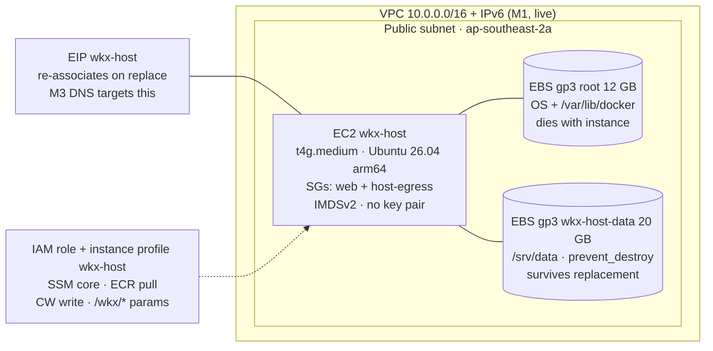

# M2: Graviton Host Design

Date: 2026-07-04
Status: Approved (ready for implementation planning)

## 1. Scope

M2 adds the Host (per `CONTEXT.md`: the single box that runs everything) to the live M1 network. Everything lands by extending the existing `infra/aws/` Terraform root, plus one new file, `host/cloud-init.yaml`. No Caddy, no Compose stack, no DNS records yet; those are M3.

**Hands-on artefacts** (from `ROADMAP.md`, unchanged):

- `aws ssm start-session --target <instance-id>` connects without SSH.
- On the box: `docker run hello-world` works; `df -h /srv/data` shows the mounted data volume.



## 2. Decisions made in this brainstorm

| Decision | Choice | Rationale |
|---|---|---|
| Terraform root placement | Extend `infra/aws/` | Direct references to the M1 VPC, subnet, and security groups; one state, one plan. Design spec §5 already scopes `infra/aws/` as "account, VPC, EC2, IAM ...". No remote-state plumbing. |
| Ubuntu release | 26.04 LTS (Resolute) | Current LTS, support to 2031, avoids an OS replacement cycle in a year. Supersedes the roadmap's 24.04, which was written before 26.04 shipped. ROADMAP gets a one-line update. |
| AMI selection | Canonical SSM public parameter | Resolved at plan time via a data source; no hardcoded AMI ID ever (see §4). |
| Backups-bucket IAM | Defer to M10 | The bucket does not exist until M10; granting nothing now is strict least privilege. M10 adds the statement to the same role. ROADMAP's M2 bullet gets a note. |
| `/srv/data` provisioning | Separate 20 GB gp3 volume | App data survives instance replacement; M10 snapshots target only the data volume. Root stays a 12 GB throwaway. |
| `host/` layout | Self-contained `cloud-init.yaml` | No `host/shared/` until M9 gives it a second consumer. Rendered via `templatefile()` for the values Terraform knows (data-volume ID). |
| Host lifecycle | Replace on bootstrap change | `user_data_replace_on_change = true`. Cattle semantics: the box always matches its declared bootstrap. EIP re-associates; data volume re-attaches; `/srv/data` survives. |
| CPU credits | `standard`, not `unlimited` | Hard cost cap: an exhausted credit bank throttles to baseline instead of buying surplus credits (worst case roughly USD $47/mo extra). The workload idles far below baseline; M4 charts `CPUCreditBalance`. |
| Savings Plan timing | Stays at M10 | The on-demand burn-in (about NZD $62/mo, over budget) is accepted as temporary while t4g.medium proves itself. Committing early would lock the size before it has carried real workloads. |

## 3. Terraform shape

New files, following the M1 one-concern-per-file convention. All live in the existing `infra/aws/` root except the cloud-init template, which starts the repo-root `host/` directory (Layer 2):

| File | Contents |
|---|---|
| `ami.tf` | `data "aws_ssm_parameter"` resolving the Canonical Ubuntu 26.04 arm64 AMI |
| `iam.tf` | Role `wkx-host`, trust policy for EC2, three custom policies plus one managed attachment, instance profile |
| `ec2.tf` | `aws_instance.host` (t4g.medium, IMDSv2, root volume block, user_data via `templatefile()`), `aws_ebs_volume.data`, `aws_volume_attachment` |
| `eip.tf` | `aws_eip.host` plus `aws_eip_association` |
| `outputs.tf` | adds `instance_id`, `host_public_ip`, `data_volume_id`, `instance_profile_name` |
| `tests/host_invariants.tftest.hcl` | plan-time invariant assertions (§8) |
| `host/cloud-init.yaml` | cloud-init user-data template (§7) |

All M2 resources are host-level: they carry the provider `default_tags` (`Project=wkx`, `ManagedBy=terraform`, `Repo=wkx-platform`) plus a `Name`, and deliberately omit `Env`/`Service`, exactly like every M1 resource.

## 4. AMI resolution

Never a hardcoded `ami-...` literal. Terraform reads Canonical's published public parameter:

```hcl
data "aws_ssm_parameter" "ubuntu_arm64" {
  name = "/aws/service/canonical/ubuntu/server/26.04/stable/current/arm64/hvm/ebs-gp3/ami-id"
}
```

The 24.04 form of this path is verified against Canonical's AWS documentation; the 26.04 parameter follows the same documented `ubuntu/$PRODUCT/$RELEASE/...` scheme and gets a live `aws ssm get-parameters` check as the first implementation step.

Because `current` moves with Canonical's image releases, the data source alone would try to replace the instance whenever a new AMI is published. The instance therefore sets `lifecycle { ignore_changes = [ami] }`: AMI refreshes happen deliberately (taint or bootstrap change), not as a surprise side effect of an unrelated plan.

## 5. IAM instance profile, least privilege

One role, `wkx-host`, assumed by `ec2.amazonaws.com`, wrapped in an instance profile:

| Grant | Mechanism | Scope |
|---|---|---|
| SSM Session Manager + RunCommand | AWS managed policy `AmazonSSMManagedInstanceCore` | Agent registration, sessions, command execution. The standard minimal policy for both. |
| ECR pull | Custom policy | `ecr:GetAuthorizationToken` on `*` (API requirement); `ecr:BatchGetImage`, `ecr:GetDownloadUrlForLayer`, `ecr:BatchCheckLayerAvailability` on `repository/*` in this account and region. Pull-only, no push. |
| CloudWatch write | Custom policy | `logs:CreateLogStream`, `logs:PutLogEvents`, `logs:DescribeLogStreams` on `log-group:/wkx/*` only (groups themselves are created by Terraform in M4); `cloudwatch:PutMetricData` with a `cloudwatch:namespace` condition pinned to `CWAgent` (the agent default; M4 may rename it and adjusts the condition if so). |
| SSM Parameter read | Custom policy | `ssm:GetParameter`, `ssm:GetParameters`, `ssm:GetParametersByPath` on `parameter/wkx/*`. SecureStrings use the AWS-managed `aws/ssm` key, so no extra KMS statement. |
| S3 backups write | Deferred to M10 | No statement in M2. M10 creates the bucket and adds the grant to this same role. |

## 6. Instance and volumes

- **Instance:** `t4g.medium` in the M1 public subnet, security groups `web` + `host-egress`, dual-stack (public IPv4 via EIP, IPv6 from the subnet).
- **No SSH surface:** no `key_name`, port 22 closed (M1 invariant), access via SSM only (ADR 0003).
- **IMDSv2 required:** `http_tokens = "required"`, hop limit 2 so containers can reach instance credentials through Docker's NAT if ever needed.
- **CPU credits:** `standard`, not the t4g default `unlimited`: a runaway loop cannot buy surplus credits and blow the budget; sustained throttling would show in M4 dashboards, and the documented upgrade is t4g.large, not surprise burst spend.
- **Root volume:** 12 GB gp3, encrypted (default EBS KMS key), delete-on-termination. Holds OS plus `/var/lib/docker`; treated as disposable.
- **Data volume:** `aws_ebs_volume.data`, 20 GB gp3, encrypted, same AZ, `prevent_destroy`, attached as `/dev/sdf`. Independent of the instance's lifecycle; this is what M10 snapshots.
- **Monitoring:** basic (5-minute, free). Detailed monitoring adds cost for no M4 benefit; the CloudWatch agent supplies richer host metrics anyway.
- **EIP:** `aws_eip.host` plus explicit `aws_eip_association`, so replacement instances pick the same public IP back up and M3's DNS records stay valid.

## 7. cloud-init (`host/cloud-init.yaml`)

A single self-contained template, rendered by `templatefile()` with the data-volume ID. First boot, in order:

1. **apt update + upgrade**, then install prerequisites.
2. **Docker Engine + Compose plugin** from Docker's official apt repository (arm64): `docker-ce`, `docker-ce-cli`, `containerd.io`, `docker-buildx-plugin`, `docker-compose-plugin`. Ubuntu's `docker.io` lags too far for a platform whose upgrade story (M7 Renovate) assumes current engines.
3. **Data volume format-if-blank + mount:** cloud-init's `fs_setup` creates ext4 labelled `wkx-data` only when the device has no filesystem (first boot ever); `mounts` adds `LABEL=wkx-data` to `/srv/data` with `nofail`. On a replacement instance the existing filesystem is detected and simply mounted. The device is addressed via the stable `/dev/disk/by-id/nvme-Amazon_Elastic_Block_Store_vol...` symlink derived from the templated volume ID, not the racy `/dev/sdf` name.
4. **`platform` user:** system user, member of `docker`, no password, no SSH keys, owns `/srv/data`. Compose workloads run as this user from M3 on.
5. **Agents:** assert the preinstalled SSM agent (snap) is enabled and running; install the CloudWatch agent arm64 package but leave it unconfigured; its config is an M4 deliverable.

Nothing else. Caddy, the platform Compose stack, unattended-upgrades (M7), and restic (M10) all arrive in their own milestones.

## 8. Testing and verification

**Plan-time invariants** (`tests/host_invariants.tftest.hcl`, same style as M1's security test):

- Instance has no `key_name` (no-SSH invariant, ADR 0003).
- `metadata_options.http_tokens == "required"`.
- Instance security groups are exactly `web` + `host-egress`.
- Root and data volumes are encrypted gp3.
- `user_data_replace_on_change == true` and the AMI comes from the SSM parameter data source.

**Live verification** after apply:

```bash
# session without SSH (hands-on artefact)
aws ssm start-session --target "$(terraform output -raw instance_id)"

# on the box
docker run hello-world          # engine + arm64 image pull work
df -h /srv/data                 # 20 GB ext4, labelled wkx-data
id platform                     # user exists, in docker group
sudo ss -tlnp | grep ':22'      # empty: nothing listens on 22
```

**Replacement drill** (proves the cattle semantics before M3 depends on them): touch a comment in `cloud-init.yaml`, apply, confirm the instance is replaced, the EIP survives, and a marker file written to `/srv/data` beforehand is still there.

## 9. Cost

M2 starts the always-on meter. On-demand (until the Savings Plan):

| Line item | USD/mo |
|---|---|
| EC2 t4g.medium, on-demand, ap-southeast-2 (about $0.042/hr) | ~31.00 |
| EBS gp3 32 GB (12 root + 20 data) | ~3.07 |
| Elastic IP (public IPv4) | ~3.65 |
| **Total on-demand** | **~37.70** |
| Same stack after the 1-yr Compute Savings Plan (M10) | ~23.70 |

**Budget flag:** on-demand is about USD $38/mo, roughly NZD $62/mo, which is over the NZD $50 budget until the Savings Plan lands. The design spec anticipated 2 to 4 weeks on-demand; the M2 handoff's "about $24/mo on-demand" figure was actually the post-Savings-Plan number. **Decided:** the overage is accepted as the planned burn-in and the Savings Plan purchase stays at M10, locking in roughly NZD $40/mo from there. The billing alarm itself remains M4.

## 10. Documentation updates in M2

- `ROADMAP.md`: 24.04 to 26.04; note that the S3 backups grant moved to M10.
- `docs/setup/m2-infra-state.md` (public-safe template) plus gitignored `.local.md` sibling recording instance ID, EIP, volume ID.
- `CLAUDE.md` repository-state paragraph: infra and host code now exist.

## 11. Out of scope

- Caddy, platform Compose stack, DNS records: M3.
- CloudWatch agent configuration, dashboards, billing alarm: M4.
- SSM parameters themselves and the secrets helper: M5.
- `host/shared/` and `host/bootstrap.sh`: M9.
- Backups bucket, restic, DLM snapshots, S3 IAM grant: M10.
