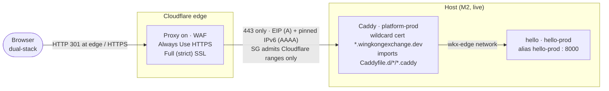

# M3: Caddy + TLS Design

Date: 2026-07-05
Status: Approved (ready for implementation planning)

## 1. Scope

M3 puts the platform services layer (Layer 3) on the Host: a custom-built Caddy terminating TLS with one wildcard certificate, a routing contract that projects plug into with a single file, and a real `hello` app proving the whole path from browser to container. It also makes one small Layer 2 change: cloud-init gains `git` and the AWS CLI (prerequisites of the deploy model), which replaces the Host per ADR 0017. Deploys are manual through an SSM session; automation is M6's job.

**Hands-on artefacts** (from `ROADMAP.md`, unchanged):

- `https://hello.wingkongexchange.dev` returns 200 with valid TLS in a browser.
- `curl -sI` against the EIP directly is blocked (proves the security group works).

One ROADMAP correction: "Origin SG hardened to Cloudflare IP ranges only" was delivered in M1 (the `web` security group already admits 443 solely from Cloudflare prefix lists, both IP families). M3 verifies it live rather than building it.



Port 80 stays closed end to end: Cloudflare redirects HTTP at its edge, Caddy issues certificates via DNS-01, and the origin's only listener is 443. Edge to origin runs over HTTPS against Caddy's Let's Encrypt certificate, which Full (strict) mode validates.

## 2. Decisions made in this brainstorm

| Decision | Choice | Rationale |
|---|---|---|
| hello realisation | Real mini-app with its own Dockerfile and ECR repo | Exercises the full per-project contract (build, ECR, Compose, snippet) from day one; genuinely extractable at M6 and reference-worthy at M8. |
| Getting files onto the Host | Git clone of `wkx-platform` on the box | Repo is public, so no auth; deploys are `git pull` + `compose up` in an SSM session; matches M9's home-server model. M6 replaces the by-hand pull with SSM RunCommand. |
| Cloudflare token to SSM | Terraform-managed: AWS provider added to the cloudflare root, `aws_ssm_parameter` SecureString | No manual copy step to forget; the secret already lives in that root's encrypted state, so no new exposure surface. Rotation is an apply plus an on-box env-file re-render and Caddy recreate; the runbook is an M10 deliverable. Supersedes `token.tf`'s "moved to SSM in M5" comment; M5 builds the render-to-env-file tooling on top. |
| IPv6 at the origin | Pin a static IPv6 on the instance; AAAA points at it | The IPv6 analogue of the EIP: survives host replacement (ADR 0017 cattle semantics), keeps the ROADMAP's A + AAAA deliverable honest, gives dual-stack edge-to-origin. |
| Wildcard cert vs snippet contract | `auto_https prefer_wildcard` + plain host-block snippets | Keeps CONTEXT.md's "snippet = one host block" contract untouched and the single-cert deliverable. Current Caddy docs (2.10+) make wildcard reuse the default; the flag covers 2.8/2.9. Fallback recorded: single wildcard site with matcher + handle snippets. |
| Caddyfile import glob | `import /etc/caddy/Caddyfile.d/*/*.caddy` | All services, all envs on this host. The ROADMAP's `*/<env>.caddy` wording was shorthand; a per-env glob would break M11 preview envs, which share this Caddy. |
| ECR repo naming | `wkx/<service>` (`wkx/caddy`, `wkx/hello`) | Matches the path-style `/wkx/<service>/...` namespacing of SSM parameters and log groups, rather than the flat `wkx-` prefix used by infrastructure resource names. |
| Shared app network | Platform stack owns `wkx-edge` (fixed name); apps join as external with alias `<service>-<env>` | Single owner for the network; the alias is the upstream address Caddy snippets `reverse_proxy` to; Compose projects follow the same `<service>-<env>` shape (`platform-prod`, `hello-prod`). |
| EIP / IPv6 into the cloudflare root | New variables via the existing gitignored `*.local.tfvars` pattern | Consistent with how `cloudflare_account_id` is supplied; keeps real addresses out of committed files (Invariant 7); no cross-root remote-state coupling. |

## 3. Terraform shape

### 3.1 aws root (`infra/aws/`)

| File | Contents |
|---|---|
| `ecr.tf` (new) | Two `aws_ecr_repository` resources: `wkx/caddy` and `wkx/hello`. Immutable tags (tags are content-addressed `<sha>`), scan on push. No lifecycle policies yet; those are an M6 deliverable with the `ecr-repo` module, which these repos migrate into. |
| `ec2.tf` (edit) | `ipv6_addresses = [cidrhost(aws_subnet.public.ipv6_cidr_block, 16)]` pins the Host's IPv6. Replacement instances re-request the same address. |
| `outputs.tf` (edit) | Adds `host_ipv6_address`, `caddy_ecr_repository_url`, `hello_ecr_repository_url`. |
| `tests/` (edit) | New invariants: both ECR repos immutable with scan-on-push; the instance carries the pinned IPv6. |
| `host/cloud-init.yaml` (edit) | Adds `git` to packages and `aws-cli` (snap) to runcmd: prerequisites of the repo-checkout deploy model, owned by Layer 2 so a replacement Host needs no undocumented installs. Applying this replaces the Host (ADR 0017, drill already exercised). |

Tagging: the ECR repos are per-service resources, so they carry `Service=caddy` / `Service=hello` plus `Repo=wkx-platform`, and omit `Env` (images are per-commit; the env decides which tag deploys where). The IPv6 address is host-level like the EIP.

### 3.2 cloudflare root (`infra/cloudflare/`)

| File | Contents |
|---|---|
| `records.tf` (new) | Proxied A record `hello` → EIP and proxied AAAA record `hello` → pinned IPv6. Both values arrive as new variables via the gitignored `*.local.tfvars` pattern. |
| `zone_settings.tf` (new) | `ssl = strict` (Full strict), `always_use_https = on`, `min_tls_version = 1.2`. Makes the "redirect at the edge, no port 80" invariant Terraform-managed instead of console defaults. |
| `ssm.tf` (new) | `aws_ssm_parameter` SecureString `/wkx/caddy/prod/CLOUDFLARE_API_TOKEN` holding the existing zone-scoped DNS Write token. Tagged `Service=caddy`, `Env=prod`. |
| `providers.tf` (edit) | Adds the AWS provider (same region and `default_tags` shape as the aws root) so this root can write the parameter. |
| `token.tf` (edit) | Comment updated: the token lands in SSM at M3, not M5. |

## 4. Platform layer (`platform/`)

```
platform/
├── compose.yml        Caddy only (CloudWatch agent lands M4, backup runner M10)
├── Caddyfile          global options + wildcard site + snippet import
├── caddy/
│   └── Dockerfile     xcaddy build with the caddy-dns/cloudflare plugin
└── env/
    └── prod.env       non-secret platform env (currently minimal)
```

### 4.1 Caddy image (`platform/caddy/Dockerfile`)

```dockerfile
FROM caddy:2-builder AS builder
RUN xcaddy build --with github.com/caddy-dns/cloudflare

FROM caddy:2
COPY --from=builder /usr/bin/caddy /usr/bin/caddy
```

Built for `linux/arm64` on the Mac (Apple silicon builds it natively) and pushed to `wkx/caddy` tagged with the platform repo's short git SHA. Renovate picks up the base-image pins at M7.

### 4.2 Caddyfile

```caddyfile
{
	auto_https prefer_wildcard
}

*.wingkongexchange.dev {
	tls {
		dns cloudflare {env.CLOUDFLARE_API_TOKEN}
	}
	respond 404
}

import /etc/caddy/Caddyfile.d/*/*.caddy
```

One DNS-01 wildcard certificate for `*.wingkongexchange.dev`; project snippets stay plain host blocks and ride it. The plan's first implementation task verifies `prefer_wildcard` against the exact Caddy version the image builds, with the single-wildcard-site pattern (matcher plus handle snippets) as the recorded fallback. Unmatched subdomains get a 404 from the wildcard block.

No ACME account email is configured: it is optional, and Let's Encrypt no longer sends expiry notifications, so the knob earns nothing.

### 4.3 Compose stack (`platform/compose.yml`)

```yaml
# run as: docker compose -p platform-prod up -d
services:
  caddy:
    image: <PLATFORM_ACCOUNT_ID>.dkr.ecr.ap-southeast-2.amazonaws.com/wkx/caddy:<sha>
    restart: unless-stopped
    mem_limit: 256m
    cpus: 0.5
    ports:
      - "443:443"
    env_file:
      - /srv/secrets/caddy/prod.env      # CLOUDFLARE_API_TOKEN, rendered from SSM
    volumes:
      - ./Caddyfile:/etc/caddy/Caddyfile:ro
      - /etc/caddy/Caddyfile.d:/etc/caddy/Caddyfile.d:ro
      - /srv/data/caddy/prod/data:/data          # certificates persist here
      - /srv/data/caddy/prod/config:/config
    networks: [wkx-edge]

networks:
  wkx-edge:
    name: wkx-edge
```

Certificates live on the Data volume under the standard `/srv/data/<service>/<env>` pattern, so host replacement never re-issues certs. Only 443/TCP is published: Cloudflare reaches origins over TCP, and edge HTTP/3 terminates at Cloudflare. The secrets env-file path pre-adopts M5's `/srv/secrets/<service>/<env>.env` standard (mode 600, owned by `platform`, regenerated on deploy).

## 5. The hello app (`hello/`)

A real mini-app at the repo root, laid out exactly like a future `wkx-hello` repo so the M6 extraction is a directory copy:

```
hello/
├── src/app.py         stdlib HTTP server, port 8000; responds with MESSAGE
├── Dockerfile         python:3.13-slim, arm64, non-root
├── compose.yml        one service, wkx-edge external, alias hello-${ENV}
├── caddy.snippet      one host block, env-templated
└── README.md
```

`app.py` answers 200 with a `MESSAGE` environment variable defaulting to a hello page. That makes M5's hands-on artefact (set `/wkx/hello/prod/MESSAGE`, redeploy, see the new value) a config change rather than a code change.

The deployed snippet at `/etc/caddy/Caddyfile.d/hello/prod.caddy`:

```caddyfile
hello.wingkongexchange.dev {
	reverse_proxy hello-prod:8000
}
```

prod hides the env suffix in the hostname per the naming model; the alias and Compose project keep it explicit. At M3 the snippet is rendered by hand from `caddy.snippet`; M6's deploy script takes that over.

## 6. Deploy procedure (manual until M6)

1. **Apply the aws root.** ECR repos and pinned IPv6 land; capture new outputs.
2. **Build and push images** from the Mac: `aws ecr get-login-password | docker login`, then arm64 builds of `wkx/caddy:<sha>` and `wkx/hello:<sha>`.
3. **Apply the cloudflare root.** DNS records, zone settings, and the SSM token parameter land (EIP and IPv6 supplied via the local tfvars).
4. **Bootstrap the box** in an SSM session, as the `platform` user: clone `wkx-platform` to `/home/platform/wkx-platform`, create `/etc/caddy/Caddyfile.d/`, render `/srv/secrets/caddy/prod.env` from SSM (`aws ssm get-parameter --with-decryption`, mode 600), ECR login using the instance role.
5. **Start the stacks:** `docker compose -p platform-prod up -d` in `platform/`, then `ENV=prod docker compose -p hello-prod up -d` in `hello/`, drop the rendered snippet, and `caddy reload` inside the container.
6. **Verify** (§7) and record the state docs.

Subsequent deploys are `git pull` plus the relevant `compose up` / `caddy reload`, matching M9's home-server model of a repo checkout on the box. The checkout is disposable (root volume); nothing under it holds state.

## 7. Testing and verification

**Plan-time invariants** (extending the existing test files):

- Both ECR repos: immutable tags, scan on push.
- The instance carries the pinned IPv6 address.
- Existing invariants (no key pair, IMDSv2, encrypted gp3 volumes, SSM-sourced AMI) keep passing.

**Live verification** after deploy:

```bash
curl -s -o /dev/null -w '%{http_code}' https://hello.wingkongexchange.dev   # 200
curl -sI http://hello.wingkongexchange.dev | head -1                         # 301 from the Cloudflare edge

# on the box (through the proxy you would see Cloudflare's edge certificate,
# so Caddy's wildcard is checked at the origin):
openssl s_client -connect 127.0.0.1:443 -servername hello.wingkongexchange.dev </dev/null 2>/dev/null \
  | openssl x509 -noout -ext subjectAltName                                  # *.wingkongexchange.dev
curl -s --max-time 5 https://<EIP> ; echo $?                                 # timeout: SG drops direct traffic
# on the box (unrouted subdomains have no DNS record, so this cannot be tested
# through the edge; resolve straight to the local Caddy instead):
curl -sk -o /dev/null -w '%{http_code}' \
  --resolve unrouted.wingkongexchange.dev:443:127.0.0.1 \
  https://unrouted.wingkongexchange.dev                                       # 404 from the wildcard block
```

On the box: cert material exists under `/srv/data/caddy/prod/data`; both Compose projects are up; the token file is mode 600 and owned by `platform`.

**Replacement resilience:** after M2's drill pattern, a replaced Host re-acquires the same EIP and IPv6 and remounts `/srv/data`. The repo checkout, `/etc/caddy/Caddyfile.d/`, and `/srv/secrets/` live on the root volume and die with the instance, so the deploy procedure re-runs from step 4; certificates are not re-issued because Caddy's data dir is on the Data volume.

## 8. Cost

Effectively nil delta: ECR storage for two small images, well under a dollar a month. The always-on line items are unchanged from M2.

## 9. Documentation updates in M3

- `ROADMAP.md`: SG hardening was delivered in M1 (M3 verifies); import glob is `*/*.caddy`; token lands in SSM at M3.
- `infra/cloudflare/token.tf`: comment updated (SSM at M3, not M5).
- `docs/setup/m3-infra-state.md` (public-safe template) plus gitignored `.local.md` sibling recording ECR URLs, pinned IPv6, deployed image tags.
- `CLAUDE.md` repository-state paragraph: `platform/` and `hello/` now exist.
- `CONTEXT.md`: new terms Platform stack, Edge network, Edge alias; Platform services entry notes the `<service>` namespace slot.
- ADR 0018 (one wildcard certificate, plain host-block snippets) and ADR 0019 (shared Edge network with `<service>-<env>` aliases).

## 10. Out of scope

- CloudWatch agent configuration, Caddy access-log shipping, dashboards: M4.
- Secrets helper and generalised env-file rendering: M5 (M3's single hand-rendered env file is the seed).
- CI/CD, deploy script, ECR lifecycle policies, extracting hello to `wkx-hello`: M6.
- Reference project under `template/`: M8 (hello is its ancestor).
- Home profile of the platform stack: M9.
