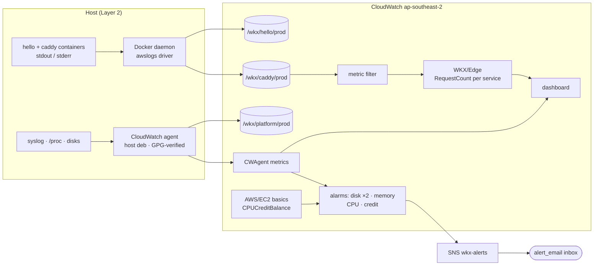

# M4: Observability Design

Date: 2026-07-06
Status: Approved (ready for implementation planning)

## 1. Scope

M4 gives the platform eyes: every log a Service or the Host produces lands in CloudWatch under the `/wkx/` namespace, host metrics flow to the `CWAgent` namespace, one dashboard shows the box's vital signs plus per-service request rate, and four alarm types (disk, memory, CPU usage, CPU credit), five alarms in all, email via SNS. Billing alerting is already delivered by the `wkx-org-monthly` budget in `infra/mgmt/`, so M4 adds none. Everything is Terraform-managed in the existing `infra/aws/` root, platform account only. Responsibilities split by layer, and each piece does only what it is naturally good at:

- **Docker daemon (Layer 2)** ships container logs straight to per-service log groups via the `awslogs` log driver, authenticated by the instance role. Dual logging (Docker's default since 20.10) keeps `docker logs` working on the box.
- **CloudWatch agent (Layer 2, host deb, GPG-verified)** handles host-level concerns only: syslog shipping and CPU, memory, disk, and network metrics.
- **CloudWatch metric filters** derive request-rate metrics from Caddy's access logs server-side. Nothing extra runs on the box for that.

**Hands-on artefacts** (from `ROADMAP.md`; the second is amended, see below):

- Tail Caddy and hello logs in the CloudWatch console.
- Force a host alarm in test mode; email arrives at the configured address.



**ROADMAP amendments.** Three parts of the M4 entry change:

1. "Docker container logs (JSON file driver)" becomes the `awslogs` driver. Docker's JSON log files live under content-addressed container paths (`/var/lib/docker/containers/<container-id>/`), so the agent's path-to-log-group mapping cannot route them per service without a fragile deploy-time shim.
2. syslog's `/wkx/system/<env>` becomes `/wkx/platform/<env>`. "system" is a token that appears nowhere in the glossary; "platform" already occupies the service slot without naming a Service (the `platform-<env>` Compose project), and the tagging strategy already treats platform as the shared category.
3. The billing-alarm deliverable and its test-mode artefact go. The wallet guard is the `wkx-org-monthly` budget in `infra/mgmt/` (80% actual and 100% forecasted of USD 45), which landed while M4 was being designed; the artefact becomes forcing a host alarm with `set-alarm-state`, which proves the same SNS-to-email path.

**Spec correction.** Design spec §4 lists the CloudWatch agent as a Layer 3 platform service in `platform/compose.yml`; the §3 architecture diagram draws it accordingly. Reality since M2 is a host deb installed by cloud-init, and the GPG deliverable assumes it stays one: a containerised agent would need `/proc`, `/var/log`, and Docker log-directory host mounts plus elevated privileges, for no functional gain on a single box. M4 corrects the spec: the agent is Layer 2 (host bootstrap). The correction ripples to CONTEXT.md's Platform services entry and is ADR material for the grill.

## 2. Decisions made in this brainstorm

| Decision | Choice | Rationale |
|---|---|---|
| Container log shipping | Docker `awslogs` driver per Compose service | Per-service log groups fall out of driver config instead of path archaeology; the daemon authenticates via the instance role; dual logging keeps `docker logs` working. Rejected: agent tailing JSON files (content-addressed paths cannot map to per-service groups); containerised agent (host mounts and privileges for nothing). |
| Cloud-only logging config | `compose.cloud.yml` overlay beside each `compose.yml` | Base compose files stay driver-free so the home server (M9) never sees AWS config. The overlay pair becomes part of the platform contract (M8 reference project). |
| Agent placement | Host deb, GPG-verified, config via SSM | Matches M2 reality and the roadmap's GPG deliverable; corrects design spec §4. Config changes are a Terraform apply plus SSM RunCommand re-fetch, not a host replacement. |
| syslog log group | `/wkx/platform/<env>`, not `/wkx/system/<env>` | "platform" is an established token (directory, OS user, `platform-prod` Compose project); "system" appears nowhere in the glossary. Extends the Platform stack's borrow-the-service-slot pattern; glossary records it at the grill. |
| Billing alerting | None in M4: the guard is the `wkx-org-monthly` budget (`infra/mgmt/`, management account) | The budget alerts at 80% actual and 100% forecasted of USD 45 and landed mid-design, superseding the brainstorm's platform-account-alarm decision. A duplicate CloudWatch alarm would add an irreversible payer preference, us-east-1 plumbing, and a docs-ambiguous member-account metric for no extra protection. |
| Retention | Tiered: 7 days app and platform, 30 days Caddy access | Access logs feed the request-rate metric and answer traffic questions after the fact; app and system logs are debugging material. |
| Request rate | Per-service and total, from one metric filter | The filter extracts the request host as a dimension; the total is metric math in the dashboard. Status-class split deferred until a real need appears. |
| Alarm set | Disk ×2, memory, CPU usage, CPU credit balance | The Host runs standard CPU credits (`ec2.tf`; the invariant tests assert it), so exhaustion throttles rather than bills: the credit alarm predicts throttling, the usage alarm is the early warning that credits are burning. Five alarms, inside the free ten; all on one SNS topic. |
| Access-log wiring | One named logger (`log wkx`) in the wildcard site block | Verified on the deployed v2.11.4: covers snippet hosts and the 404 fallthrough. Snippets stay plain host blocks (ADR 0018's spirit). Not plainly documented upstream, so §8 keeps a live check; a future regression shows as a flatlined request-rate widget. |
| Alert email | `alert_email` variable, no default, value in gitignored `terraform.local.tfvars` | Invariant 7: public files never carry real account state. Same pattern as account IDs. |
| Metrics namespace | Stays `CWAgent` | The M2 IAM condition already pins it; renaming buys nothing. |

## 3. Log pipeline

### 3.1 Log groups (Terraform, `infra/aws/logs.tf`)

| Log group | Source | Retention | Tags |
|---|---|---|---|
| `/wkx/hello/prod` | hello container via `awslogs` | 7 days | `Env=prod`, `Service=hello` |
| `/wkx/caddy/prod` | Caddy runtime + JSON access logs via `awslogs` | 30 days | `Env=prod`, `Service=caddy` |
| `/wkx/platform/prod` | Host syslog via CloudWatch agent | 7 days | `Env=prod` |

`/wkx/platform/prod` omits the `Service` tag: the tagging strategy reserves `Service` for per-service resources and treats platform as the shared category. Log streams are named per container via the driver's `tag` option.

### 3.2 Compose overlays

The logging stanza is cloud-only, so it lives in a `compose.cloud.yml` overlay beside each `compose.yml` (`platform/` and `hello/`). Cloud deploys become:

```bash
ENV=prod docker compose -f compose.yml -f compose.cloud.yml -p hello-prod up -d
```

The overlay adds, per Compose service:

```yaml
services:
  web:
    logging:
      driver: awslogs
      options:
        awslogs-region: ap-southeast-2
        awslogs-group: /wkx/hello/prod
        awslogs-create-group: "false"
        tag: "{{.Name}}"
        mode: non-blocking
        max-buffer-size: "4m"
```

`awslogs-create-group: "false"` makes Terraform ownership of log groups explicit: a deploy against a missing group fails loudly instead of creating an untagged, never-expiring one. `mode: non-blocking` means a CloudWatch outage stalls log delivery, never the app; the ring buffer is raised from the 1 MB default because AWS's own awslogs guidance warns the default drops lines under burst. The home server (M9) simply never applies the overlay; the reference project (M8) inherits the pair as part of the platform contract.

### 3.3 Caddy access logs and the request-rate metric

- The wildcard site block in the platform `Caddyfile` gains a named access logger (`log wkx`), JSON format, written to stdout, so it rides the same `awslogs` pipeline into `/wkx/caddy/prod`. On the deployed v2.11.4, one wildcard-block logger demonstrably covers requests handled by the imported snippet host blocks and by the 404 fallthrough (source-verified and live-tested rather than plainly documented, hence the live check in §8).
- A metric filter on `/wkx/caddy/prod` matches access-log lines by exact logger name, `{ $.logger = "http.log.access.wkx" }` (unnamed Caddyfile loggers get auto-generated names like `http.log.access.log0`, which could shift if site blocks reorder), and extracts `$.request.host` as the `Host` dimension, publishing `RequestCount` to the `WKX/Edge` namespace.
- Per-service series come straight off the `Host` dimension; the platform total is metric math (SUM) in the dashboard widget. Requests that fall through to the wildcard 404 appear under their own host value, which makes probe traffic visible rather than hidden.
- Two documented guardrails hold this design: each distinct `Host` value bills as one custom metric, which is safe here because only hostnames with proxied zone records can reach the origin (bounded; AWS also auto-disables filters that generate 1,000 dimension pairs), and dimensioned filter metrics cannot carry a default value, so zero-traffic minutes emit no datapoint and the dashboard widget fills gaps with metric math (`FILL(m, 0)`).

## 4. Host changes

### 4.1 GPG-verified agent install

cloud-init currently curls the agent deb over HTTPS and installs it unverified. M4 replaces that step: download the deb and its `.sig` sibling (same URL plus `.sig`; the existing ap-southeast-2 mirror carries both), import Amazon's signing key from `https://amazoncloudwatch-agent.s3.amazonaws.com/assets/amazon-cloudwatch-agent.gpg`, check the fingerprint is exactly `9376 16F3 450B 7D80 6CBD 9725 D581 6730 3B78 9C72` (quoted from the agent's package-signature docs), then `gpg --verify` before `dpkg -i`. Any mismatch aborts bootstrap loudly rather than installing anyway.

### 4.2 Agent configuration via SSM Parameter Store

- The agent config JSON lives in the repo at `host/cloudwatch-agent.json`: syslog collection into `/wkx/platform/prod`, plus aggregate CPU (`usage_active`, `totalcpu` only), memory (`used_percent`), disk (`used_percent` pinned to `/` and `/srv/data`, with `drop_device: true` so Nitro device-name churn cannot break the alarms), and network bytes on the primary interface only (`net.resources` pinned; left unpinned, Docker's churning `veth*` and bridge interfaces would multiply the metric count). `append_dimensions` carries `InstanceId` alone. Net result: six custom metrics. The namespace stays `CWAgent`, matching the IAM condition pinned in M2.
- Terraform publishes the file to an SSM parameter, `/wkx/platform/prod/CLOUDWATCH_AGENT_CONFIG` (type String: the config is not a secret, and at roughly 2 KB it sits well inside the free 4 KB standard tier), inside the instance role's existing `/wkx/*` read scope.
- At boot, cloud-init runs `amazon-cloudwatch-agent-ctl -a fetch-config -m ec2 -c ssm:/wkx/platform/prod/CLOUDWATCH_AGENT_CONFIG -s`. The leading slash is required for hierarchical parameter names, and `-s` also enables the agent's systemd unit, so it survives reboots. Later config changes are a Terraform apply plus an SSM RunCommand re-fetch, with no host replacement.
- Because the metrics carry the `InstanceId` dimension and the Host is cattle (ADR 0017), the CWAgent-metric alarms take their dimension from `aws_instance.host.id` in the same root: the apply that replaces the Host re-points the alarms in the same plan.

### 4.3 Planned host replacement

Changing cloud-init replaces the Host (ADR 0017). M4 therefore includes one planned instance replacement, done first so everything else lands on the new box. The Data volume and Caddy's certificates survive; the platform stack and hello are redeployed afterwards per the M3 deploy procedure (from its step 4). The replacement drill was exercised in M2.

## 5. Alarms and notifications

### 5.1 SNS

One `wkx-alerts` topic in `ap-southeast-2` with an email subscription. The address is the `alert_email` Terraform variable with no default; the real value lives in gitignored `terraform.local.tfvars` (invariant 7), the same variable name and pattern `infra/mgmt/` already uses for its budget notifications. The email subscription needs one manual confirmation click; the state doc records it.

### 5.2 The alarms

| Alarm | Metric | Threshold |
|---|---|---|
| Disk ×2 | `disk_used_percent` on `/` and `/srv/data` | > 80% for 15 min |
| Memory | `mem_used_percent` | > 90% for 15 min |
| CPU usage | `cpu_usage_active` | > 80% for 15 min |
| CPU credit | `CPUCreditBalance` (`AWS/EC2` basic monitoring, free, 5-min datapoints) | < 144 for 15 min (25% of the t4g.medium's 576-credit bank) |

Thresholds are deliberately conservative to avoid noise and are one-line Terraform changes to tune. The Host runs standard CPU credits (`ec2.tf`; the invariant tests assert it), so an empty credit bank throttles the box to its 20%-per-vCPU baseline rather than billing surplus: the credit alarm predicts that cliff, and the usage alarm is the early warning that the bank is draining. Five alarms in total, within the ten free.

**Billing:** M4 adds no CloudWatch billing alarm. The wallet guard is the `wkx-org-monthly` budget in `infra/mgmt/` (80% actual and 100% forecasted of USD 45, emailing the same address). A duplicate alarm would have bought an irreversible payer-account preference ("Receive CloudWatch Billing Alerts"), cross-region SNS plumbing, and a docs-ambiguous member-account metric for no extra protection.

## 6. Dashboard

One Terraform-managed CloudWatch dashboard: CPU, memory, disk, network, and request rate (per-service series stacked, with the total). Widgets read from `CWAgent` and `WKX/Edge`.

## 7. Terraform shape

All in the aws root (`infra/aws/`) unless noted, file-per-concern matching the root's existing style:

| File | Contents |
|---|---|
| `logs.tf` (new) | Three `aws_cloudwatch_log_group` resources with retention and tags; the `aws_cloudwatch_log_metric_filter` publishing `RequestCount` to `WKX/Edge`. |
| `cloudwatch_agent.tf` (new) | `aws_ssm_parameter` `/wkx/platform/prod/CLOUDWATCH_AGENT_CONFIG` from `file("../../host/cloudwatch-agent.json")`. |
| `sns.tf` (new) | `wkx-alerts` topic + email subscription. |
| `alarms.tf` (new) | Disk ×2, memory, CPU alarms on `CWAgent` metrics (dimensions wired to `aws_instance.host.id`); the `CPUCreditBalance` alarm on `AWS/EC2`. |
| `dashboard.tf` (new) | `aws_cloudwatch_dashboard`, widget JSON via `jsonencode`. |
| `variables.tf` (edit) | `alert_email`, no default, format validation; same name and local-tfvars pattern as `infra/mgmt/`. |
| `iam.tf` (comment edit) | The "created by Terraform in M4" comments come true; no policy change (namespace stays `CWAgent`, log scope `/wkx/*` already covers the groups). |
| `tests/` (edit) | New invariants: every log group has a retention policy and correct tags; every alarm has at least one action; the dashboard exists; the agent-config parameter is sourced from the repo file. |
| `host/cloud-init.yaml` (edit) | GPG-verified agent install; `fetch-config` from SSM at boot. Applying replaces the Host (ADR 0017). |
| `platform/compose.cloud.yml`, `hello/compose.cloud.yml` (new) | The `awslogs` overlays (§3.2). |
| `platform/Caddyfile` (edit) | Access logging in the wildcard site block, JSON to stdout. |

## 8. Testing and verification

**Plan-time invariants** (extending the existing test files): the new `tests/` assertions in §7, and the existing invariants keep passing.

**Plan gates** (live checks at the relevant task, in the M3 "Task 1 gate" style; the draft spec's doc-verification gates were closed during the grill and their outcomes folded into §3, §4, and §5):

- `docker compose -f compose.yml -f compose.cloud.yml config` renders the merged logging stanza as intended before first deploy (the `logging:` merge rule is verified from compose-go source, not docs).
- After the Caddyfile change, access-log lines appear in `/wkx/caddy/prod` for both a snippet-routed host (hello) and an unmatched 404 host, confirming the wildcard-block logger covers imported host blocks on the running version.
- The custom-metric count in the CloudWatch console matches the expected six agent metrics plus one `RequestCount` per live hostname.

**Live verification** after deploy:

```bash
# on the Mac
aws logs tail /wkx/caddy/prod --follow          # access + runtime lines appear
aws logs tail /wkx/hello/prod --follow          # hello stdout appears
for i in $(seq 1 20); do curl -s -o /dev/null https://hello.wingkongexchange.dev; done
                                                # request-rate widget moves within a period
aws cloudwatch set-alarm-state --alarm-name <disk-alarm> \
  --state-value ALARM --state-reason "M4 test"  # email arrives
```

On the box: `amazon-cloudwatch-agent-ctl -a status` reports running; `docker logs` still works for both stacks (dual logging); the GPG verification is visible in `/var/log/cloud-init-output.log`.

## 9. Cost

Effectively zero additional cost at current scale: the always-free tier covers 5 GB of log ingest (the platform's roughly 1 GB), 10 custom metrics (six agent metrics plus one `RequestCount` per hostname), 10 alarm metrics (five used), and 3 dashboards (one used). Costs appear as the fleet grows: each new service adds a `RequestCount` metric and log volume, at USD 0.30 per metric and USD 0.50 per GB ingested in the first paid tiers. The design spec's cost table already carries USD 0.70 for logs, so steady state stays inside existing estimates.

## 10. Documentation updates in M4

- `ROADMAP.md`: the three M4 amendments (§1).
- Design spec: §4 moves the CloudWatch agent from Layer 3 to Layer 2; the §3 diagram follows.
- `CONTEXT.md`: Platform services entry drops the CloudWatch agent (leaving Caddy and the backup runner) and the Platform entry records that platform occupies the service slot for host-level emissions (`/wkx/platform/<env>`). Delivered during the grill.
- ADR candidates (grill-owned): container logs ship via the Docker `awslogs` driver; the CloudWatch agent is Layer 2 host tooling, not a platform service.
- `docs/setup/m4-infra-state.md` (public-safe template) plus gitignored `.local.md` sibling: alarm names, dashboard name, the SNS subscription confirmation.
- `CLAUDE.md` repository-state paragraph: observability now live.

## 11. Out of scope

- The home server's observability story: M9 (base compose files stay driver-free for it).
- Log-based alerting on app errors, tracing, third-party observability stacks: not on the roadmap.
- Secrets rendering generalisation (the agent-config parameter is plain config, not a secret): M5.
- Per-project log groups moving into `infra/projects/<name>.tf`: lands with the M6/M8 module structure; M4 keeps them in the aws root.
