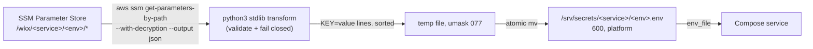

# M5: Secrets + Config Design

Date: 2026-07-10
Status: approved in brainstorm, pre-grill

## 1. Scope

M5 makes SSM Parameter Store the single source of secrets and config for every Service, and proves the path end to end through hello. Five deliverables:

1. `tools/secrets/render-env.sh`: a committed bash script that reads `/wkx/<service>/<env>/*` from Parameter Store and renders `/srv/secrets/<service>/<env>.env`. It generalises the manual render M3 performed for Caddy's `CLOUDFLARE_API_TOKEN`.
2. IMDS hop limit drops from 2 to 1 in `infra/aws/ec2.tf`, with a Terraform invariant test and an ADR.
3. hello consumes its env-file via `env_file` in `hello/compose.yml`, proven by the `/wkx/hello/prod/MESSAGE` hands-on artifact.
4. Docs: `docs/setup/m5-infra-state.md` (public template) plus its gitignored `.local.md` sibling, and `tools/secrets/README.md` as the operator runbook.
5. Amendments: `ROADMAP.md` M5 reworded (the Python/uv helper framing is dropped), one ADR recording bash-not-Python, one ADR recording the IMDS drop.

Already in place, requiring no M5 work: the parameter namespace (live since M3), the `wkx-host` role's `ssm:GetParametersByPath` on `parameter/wkx/*` (`infra/aws/iam.tf`), and the `/srv/secrets/<service>/<env>.env` convention (M3, mode 600, owner `platform`).

## 2. Decisions made in this brainstorm

1. **Render-only scope.** No `set` or `list` subcommands. Setting a parameter is a documented `aws ssm put-parameter` one-liner in the README. A wrapper can land later if the one-liner grates.
2. **Bash + aws-cli, not a Python package.** The original roadmap deliverable ("Python helper, packaged with uv") was challenged and dropped: the job is a small transform, and a uv package would have cost a pinned uv install in cloud-init (a Host replacement under ADR 0017) plus a PyPI supply chain in the deploy path. Python arrives under `tools/` when a tool genuinely outgrows bash (likely candidate: the M8 scaffold), decided at that milestone. When it does, it follows the standards in `~/dev/etoews/python/PROJECT.md`: uv, ruff, pytest, ty, Typer, `src/` layout.
3. **IMDS hop limit 1.** With secrets in Parameter Store, the instance role's credentials now unlock every `/wkx/*` value; containers must not be able to mint IMDSv2 tokens. Everything that needs AWS credentials today runs in the host network namespace. Recorded consequence for M10: a containerised backup runner needs host networking, its own credentials, or a host-level job.
4. **Parameters are set by operator CLI, never by Terraform**, so secret values stay out of state. The one exception stands: `infra/cloudflare` writes `/wkx/caddy/prod/CLOUDFLARE_API_TOKEN`, because Terraform generates that value anyway.
5. **Fail closed everywhere.** Values or keys the env-file format cannot represent abort the render; nothing is ever silently mangled.

## 3. The render script (`tools/secrets/render-env.sh`)

### 3.1 Interface

```bash
tools/secrets/render-env.sh --service <service> --env <env>
```

- Both flags required, no defaults (ADR 0006: env is always explicit).
- Output path derived: `/srv/secrets/<service>/<env>.env`. A `--output <path>` override exists for tests only.
- Runs as the `platform` user on the Host. On a dev machine or the home server (M9) it works unchanged: the aws-cli resolves credentials ambiently (instance role on the Host, profile elsewhere). The script never touches IMDS itself.

### 3.2 Data flow



### 3.3 Read

One `aws ssm get-parameters-by-path --path /wkx/<service>/<env>/ --with-decryption --output json` call; aws-cli v2 auto-paginates. String and SecureString are treated identically (decryption is transparent); StringList is written as its raw comma-joined value.

### 3.4 Transform

JSON is piped through a short `python3` stdlib one-shot (the system interpreter, no third-party dependencies), not `--output text`, because text output smears values containing tabs or newlines into phantom rows. Rules, all fail-closed:

- Key = the segment after `/wkx/<service>/<env>/`. Must match `^[A-Z][A-Z0-9_]*$`; anything else aborts.
- A parameter nested deeper (another `/` in the remainder) aborts rather than silently flattening.
- A value containing a newline or carriage return aborts. Env-file values are single-line by contract.
- The exact quoting policy for written `KEY=value` lines is verified against Compose's env-file parser during implementation (via current docs, not memory), and pinned by tests. Any value the format cannot represent is rejected.

### 3.5 Write

`umask 077`; `mkdir -p` the service directory (700); write to a temp file in the target directory; atomic `mv` into place. Result is 600, owned by the invoking user, with no partial file possible on any failure. Keys are sorted for deterministic diffs.

**Empty path** (zero parameters): render an empty file, warn on stderr, exit 0. Services without config still get a valid env-file so `required: true` in Compose never trips.

### 3.6 Observability

stderr reports the parameter count and key names, never values. Non-zero exit on any AWS or validation failure. Under M6 this output surfaces in SSM RunCommand results.

## 4. IMDS hop limit (`infra/aws/ec2.tf`)

`http_put_response_hop_limit` changes from 2 to 1; `http_tokens` stays `required`. This is an in-place attribute update (confirm at plan time: no Host replacement). Containers on bridge networks such as `wkx-edge` can no longer complete the IMDSv2 token PUT, so a compromised container cannot reach instance role credentials. Unaffected, because they run in the host network namespace: the CloudWatch agent, the `awslogs` driver (inside dockerd), and aws-cli usage for renders and ECR login.

A new invariant test in `infra/aws/tests/` pins `hop_limit == 1` and `http_tokens == "required"`.

## 5. hello wiring (`hello/compose.yml`)

The `web` service gains:

```yaml
env_file:
  - path: /srv/secrets/hello/${ENV:?}.env
    required: true
```

`required: true` is deliberate: render-before-up becomes an ordering contract, safe because the script always writes a file, even an empty one. This is the reference pattern the M8 template inherits. `platform/compose.yml` needs no change; M5 re-renders `/srv/secrets/caddy/prod.env` with the script and confirms the content matches the M3 manual render.

Implementation check: confirm changed env-file content causes `docker compose up -d` to recreate the container (config-hash behaviour). If not, the runbook prescribes `up -d --force-recreate`.

## 6. Hands-on artifact

1. From the workstation: `aws ssm put-parameter --name /wkx/hello/prod/MESSAGE --type String --value "hello world"`, then tag it (`Service=hello`, `Env=prod`) with `aws ssm add-tags-to-resource`.
2. On-box (SSM session, as `platform`): `render-env.sh --service hello --env prod`, then `docker compose -f compose.yml -f compose.cloud.yml -p hello-prod up -d`. Interpolation values (`ENV`, registry, tags) come from the on-box gitignored `hello/.env`, the M3 convention. The page shows the message.
3. Update the parameter, re-render, `up -d` again. The page shows the new message.
4. Re-render Caddy: `render-env.sh --service caddy --env prod`; confirm the file matches the M3 render and Caddy stays healthy.

## 7. Testing and verification

- `tools/secrets/test.sh` (repo precedent: `hello/test.sh`): stubs `aws` on `PATH` with fixture JSON and asserts rendered content, permissions (600), sorted keys, empty-path behaviour, and every fail-closed case (multi-line value, invalid key, nested key, aws failure leaving no partial file).
- Both scripts `shellcheck`-clean; this is the stated bar for bash under `tools/`.
- `terraform fmt`, `terraform validate`, and `terraform test` for the `ec2.tf` change and the new invariant test.

## 8. Documentation updates in M5

- ADR 0022: secrets render via bash + aws-cli, not a Python helper (records the roadmap amendment and the revisit trigger).
- ADR 0023: IMDS hop limit 1 (supersedes the M2 design note "hop 2 so containers can reach instance credentials if ever needed"; records the M10 backup-runner consequence).
- `ROADMAP.md`: M5 deliverables reworded; M6's "using the M5 helper" stays true as written.
- `docs/setup/m5-infra-state.md` + gitignored `.local.md`.
- `tools/secrets/README.md`: operator runbook (setting parameters with type and tag conventions, rendering, verifying).
- `CLAUDE.md` repo-state paragraph refreshed at milestone close.
- `CONTEXT.md` terminology (env-file, render, parameter namespace) is settled during the grill that follows this design.

## 9. Out of scope

- Deploy script and CI wiring (M6; it calls `render-env.sh` on-box via SSM RunCommand).
- Any `set`/`list` tooling around Parameter Store.
- Python/uv packaging under `tools/` (revisit when a tool outgrows bash).
- Home server rendering flow (M9; the script is already compatible).
- KMS customer-managed keys: parameters use the AWS-managed `aws/ssm` key. Revisit only if cross-account access is ever needed.
